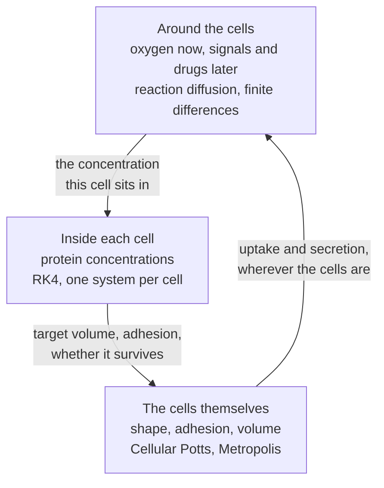
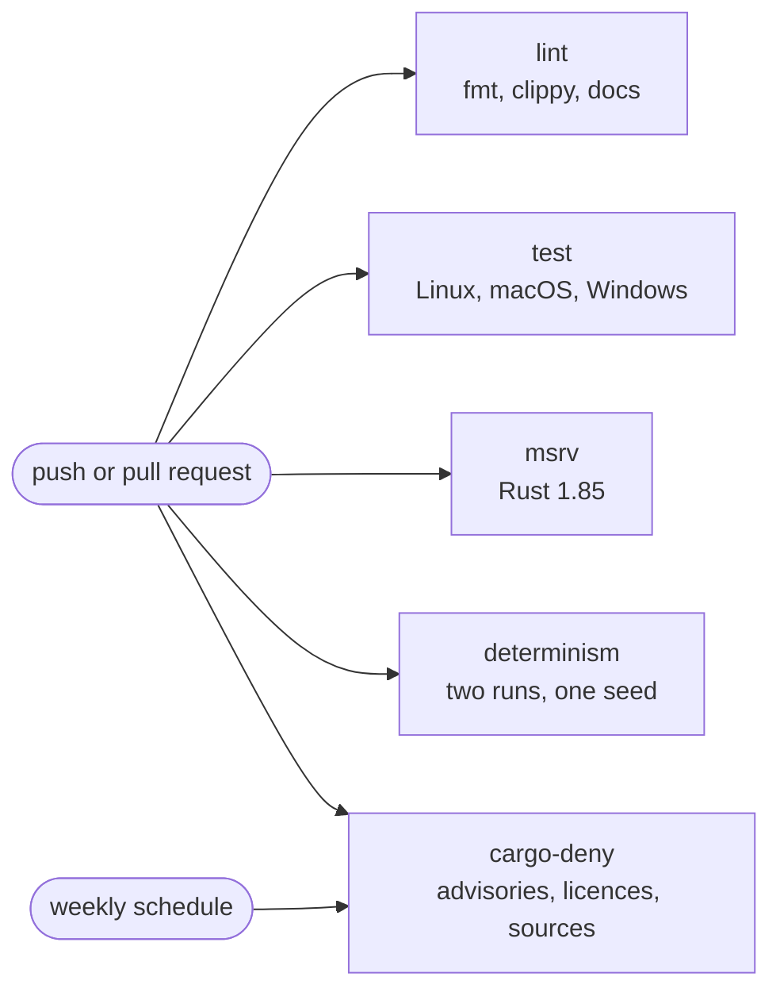
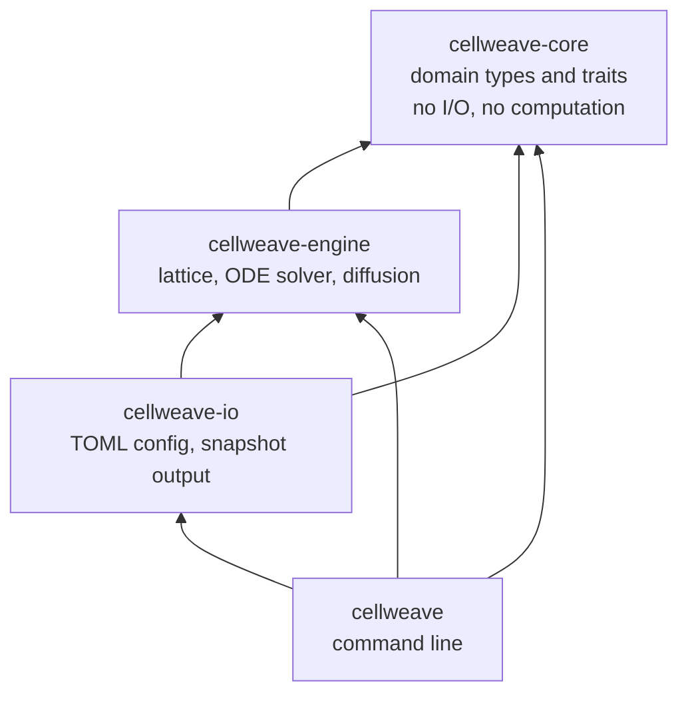

# cellweave

[](https://github.com/ngodzik/cellweave/actions/workflows/ci.yml) [](https://github.com/ngodzik/cellweave/actions/workflows/security.yml)

**cellweave runs a molecular hypothesis inside every cell, and shows what it does to the tissue.**

## What that means

A *molecular hypothesis* is a claim about biology: which proteins act on which, in which direction, and how fast. For example, low oxygen raises HIF-1a, HIF-1a raises BCL2, and BCL2 keeps the cell alive. Stated in words it sounds plausible. Written as equations it becomes something you can run.

A *tissue* here is not a sheet of paper. It is a population of cells sitting next to each other, pushing on each other, and sharing whatever diffuses between them.

So the program takes a hypothesis stated at the scale of molecules inside one cell, gives a copy of it to every cell in the population, lets the cells consume and release into the space around them, and reports what the whole population ends up doing. The question it answers is not "is this protein important" but "if this network is what is really inside each cell, what shape does the tissue take".

## Why

Going from data to a therapeutic target today is largely statistical association: this gene correlates with that outcome. What sits between the two, and is hard to get at, is the mechanism. A simulation is one way to state a mechanism precisely enough that it can be wrong.

It also does something an experiment cannot. It runs the counterfactual: the same population, the same random seed, one parameter changed, so the difference between the two runs is attributable to that parameter and to nothing else. And it can be searched, which means asking not only whether a hypothesis holds but which interventions on it produce a tissue that behaves differently.

Nothing here is validated, and none of it substitutes for an experiment. The output of a run is a hypothesis worth testing, never a result.

## How it works

Three scales, coupled, in one program:

- **The cells.** A Cellular Potts model on a lattice, where a cell is a set of pixels rather than a point. Cells have a shape, a surface, and neighbours they adhere to more or less strongly.
- **Inside each cell.** A small system of ordinary differential equations over protein concentrations, integrated per cell. Each cell carries its own state.
- **Around the cells.** Reaction diffusion fields for what moves through the space between cells, oxygen first.

The loop is the whole point. Cells change the environment that then decides their fate, so what the tissue does is not written anywhere in the code. All three arrows are wired for oxygen; what each still lacks is in [What does not work yet](#what-does-not-work-yet).



Behaviour has to follow from that model rather than from hardcoded rules. A cell grows, loosens its grip on its neighbours, or dies because its internal state says so, not because a flag was set. A necrotic core, if one appears, has to appear because the cells in the middle ran out of oxygen, not because the code drew a circle.

## Status

Early-stage personal project. Not production software, and not scientifically validated.

I am a software engineer, not a biologist. I started this to learn multiscale modelling by implementing it. I use AI assistance to write code faster and to pick up Rust idioms along the way, and I review and own everything here, mistakes included.

Mature, validated tools already exist for this kind of work. If you need results today, use CompuCell3D, Morpheus, PhysiCell or PhysiBoSS instead. cellweave overlaps with them by design, because reimplementing established methods is the point of the exercise. What differs is the engineering: Rust, a single binary, reproducible TOML configs.

Features will be added progressively, and this README will follow as they land.

## What works today

- Builds clean, `cargo clippy -D warnings` passes, 44 tests green
- 2D lattice with Monte Carlo spin flips and a volume constraint, with the boundary term pinned by four tests whose values are computable by hand
- RK4 solver for a small per-cell protein network, whose ERK level sets how large its cell tries to be. This is the upward half of the coupling, protein state driving mechanics
- Cell division: a cell that grows past a threshold splits along a line through its centre of mass, and the daughter inherits a copy of the parent's network. One cell becomes a population
- The downward half of the coupling: every lattice step, the oxygen field is relaxed to its steady state against the current layout of the cells, living cells take up oxygen where they sit, and each cell reads the mean over its own pixels into its network. Three clocks, field, network and cell cycle, are kept in the order biology has them, and a test pins the network's response time
- Three fates from that reading: a cell proliferates, or goes quiescent when its hypoxia response is high, or dies when its survival signal collapses below the anoxia threshold. A necrotic cell holds its shape and stops consuming
- A necrotic core appears in the middle of the population without any rule placing it there, at the same size and step on a 200 and a 300 pixel grid, so the box does not decide when the tissue starves. The run stops, and says so, the moment tissue touches the edge of the box, since past that point the box would be deciding what the tissue sees
- Explicit finite-difference diffusion solver, supplied by a bath held against the surface of the tissue rather than at the edge of the grid, so the size of the simulated square is not a biological parameter. It reproduces the closed-form profile of a bathed disc, and refuses a time step the explicit scheme cannot take instead of diverging quietly
- TOML configuration, JSON snapshot output per saved step
- CLI entry point

## What does not work yet

Listed plainly, because a green test suite is not the same thing as correct physics.

- **Only oxygen is coupled.** Growth factor is still a hardcoded input the same for every cell, and nothing is secreted, so VEGF is computed and goes nowhere.
- **No parallelism.** `rayon` is declared as a dependency and unused.
- **Dead cells never go away.** Nothing resorbs a necrotic cell, so the population is bounded by the box rather than by turnover, and the default grid is reached in about two hundred steps.
- **No evolution.** Daughters are exact copies. Nothing varies, so nothing is selected.
- **No calibration, no visualization.** Every constant is a placeholder: the uptake rate gives a viable rim about one cell thick where a real spheroid keeps several, and no unit of length or time has been fixed.

## Building and running

Requires Rust 1.85 or newer, which is the minimum CI builds against.

```bash
cargo build --release
cargo test --workspace

# Run with built-in defaults: 200x200 lattice, one tumor cell
./target/release/cellweave --mcs 500

# Or from a config file
./target/release/cellweave --config sim.toml
```

Snapshots are written as `output/snapshot_NNNNNN.json`. Two runs of the same configuration produce byte-identical snapshots, and CI checks that they still do.

## Checks

What every push is held to, all of it runnable locally:

```bash
cargo fmt --all -- --check
cargo clippy --workspace --all-targets -- -D warnings
cargo test --workspace
RUSTDOCFLAGS="-D warnings" cargo doc --workspace --no-deps
```

On top of that, CI builds on three platforms, holds the minimum toolchain, and checks the one property the compiler cannot see: that the same seed produces the same run, byte for byte. Without that, no result can be attributed to the change that was made rather than to the noise.



`cargo-deny` runs on a schedule as well as on a push, because an advisory published against a crate that has been in `Cargo.lock` for months arrives with no push at all.

## Architecture

Separation between layers is enforced by the crate dependency graph, so the compiler rejects inverted dependencies rather than relying on convention.



An arrow reads "depends on". Cargo refuses the reverse, so a layering mistake is a build failure rather than something a reviewer has to catch.

There is no AI or MCP dependency inside cellweave. External tools connect through the CLI. See [CLAUDE.md](CLAUDE.md) for coding rules.

## License

MIT. See [LICENSE](LICENSE).
