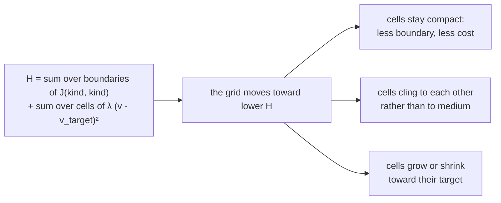

# 1. A cell is a set of pixels

How can a cell have a shape, push on its neighbours, and move, without anyone telling it where to go?

## In the body

A cell is not a point and not a ball. It is a bag of fluid held by a membrane, roughly 15 to 20 micrometres across for a tumour cell, and that membrane is never still. It ruffles, bulges, retracts, on the scale of seconds. A cell packed among others is pressed into a polygon; a cell alone rounds up. Its shape at any moment is the outcome of forces: the tension of its own membrane, how strongly it sticks to its neighbours, how much room it has, and how big it is trying to be.

Two of those forces matter most here.

**Adhesion.** Cells stick to each other through proteins on their surfaces. Cells of the same kind usually stick well; a tumour cell and healthy tissue, less so; a cell and empty space, not at all. Sticking lowers the energy of a contact, so a cell surrounded by cells it adheres to is in a lower energy state than one exposed on all sides, and cells arrange themselves to bring that energy down.

**Volume.** A cell has a size it is trying to be, set by what is going on inside it. Being larger or smaller than that costs it something, and it grows or shrinks toward it.

## In cellweave

The **lattice** (a regular grid, the word comes from garden trellis) is a 200 by 200 array of **pixels**. Each pixel carries exactly one identity: the number of the cell occupying it, or 0 for empty **medium**, or a marker for an obstacle no cell can enter. A cell is the set of pixels carrying its number. It has no shape of its own; its shape is that set, and it changes with every pixel that changes hands. A cell of radius 8 is about 200 pixels, so a pixel is roughly a micrometre, though no unit has been fixed.

This is a **Cellular Potts model** (CPM), after the physicist whose spin model it borrows. Every configuration of the grid has an **energy**, called the Hamiltonian, and the model moves toward lower energy. Two terms:

- **Contact energy.** Every pair of neighbouring pixels that belong to different cells is a piece of boundary, and it costs `J(kind of one, kind of the other)`. Boundary against medium costs 16, against a cell of the same kind 2. Lower is stickier. Two pixels of the same cell cost nothing: there is no boundary inside a cell.
- **Volume constraint.** Each cell has a target volume and a stiffness λ (lambda), and a cell of v pixels that aims at v_target pays λ (v - v_target)².

Nothing says "be round" or "hold together". Those follow from the fact that boundary costs and that same-kind boundary costs less.

### How it moves: Monte Carlo

The grid does not compute where cells should go. It tries random changes and keeps the ones that make sense. One **Monte Carlo step** (MCS) is 40,000 attempts on a 200 by 200 grid, as many as there are pixels, so that each pixel has had a chance to change hands once on average:

1. pick a pixel at random, and one of its four neighbours at random
2. propose that the pixel take the neighbour's identity: one cell gains a pixel, another loses one
3. compute the change in energy, ΔH (delta H), that this would cause
4. accept it if ΔH is negative, energy goes down
5. if ΔH is positive, accept it anyway with probability `exp(-ΔH / T)`

Step 5 is the whole idea. Without it, cells would freeze in the first passable shape. Accepting a costly move now and then lets them rearrange, squeeze past each other, and find a better configuration on the far side of a bad one. **T** is the **temperature**: a knob for how often that happens. High, cells fluctuate and can shed fragments; low, they freeze. It stands in for the constant ruffling of a real membrane.

Because every accepted move is a random draw, the same **seed** gives the same draws gives the same simulation, byte for byte. That is what makes two runs comparable, and it is checked on every push.

## Choices, and why

**Pixels rather than points.** Other simulators represent a cell as a point with a position, which is cheaper, but a point has no shape and no surface. Shape and contact are what the biology here is about, so a lattice it is.

**Four neighbours, not eight.** The energy counts boundary along pixel faces. Diagonal contacts are not boundary. This is the usual choice and it keeps the geometry simple; it does mean a cell one pixel wide is a valid wall.

**The Kronecker delta is on identity, not kind.** Two pixels of the same cell share no boundary and cost nothing; two distinct cells of the same kind in contact do pay `J(kind, kind)`. Getting this wrong was the first real bug in the project: the energy was charged by kind, so a cell was paying for boundary with itself, and the boundary loop skipped a term. It compiled, passed lint, and had twelve green tests. It was wrong anyway, and only a picture showed it. Four tests now pin values that can be computed by hand: punching a hole in a cell costs four boundary units, growing an isolated bump costs two, sliding a diagonal corner costs nothing.

**Obstacles are not cells.** A vessel wall is a pixel marked as untakeable. It has no record, no energy, no volume; a flip into or out of it is simply never proposed. It costs a cell what medium would cost to rest against.

## Where in the code

`crates/engine/src/cpm.rs`

- `CpmLattice` holds the grid and one `CellRecord` per cell: kind, volume, target volume, λ.
- `ContactEnergy` is the table of `J` for every pair of kinds, with `between(a, b)`.
- `delta_h` is the energy change of one proposed flip, split into `contact_delta_h` and `volume_delta_h` so each can be tested alone.
- `try_flip` is one attempt, steps 1 to 5 above; `monte_carlo_step` is 40,000 of them.
- `OBSTACLE` is the identifier no cell can take; `add_obstacle_disc` places one.
- `divide` cuts a cell in two, chapter 4.

The tests at the bottom of the file are the best description of what the energy means.

## Still a placeholder

The values in `ContactEnergy`, 16 for medium against tumour, 2 for tumour against tumour, 6 for normal against normal, are the sort of numbers the literature uses, not measurements of any cell line. So is λ at 50, and the temperature at 10. They give compact cells that hold together and fluctuate visibly. That is all they were chosen for.
