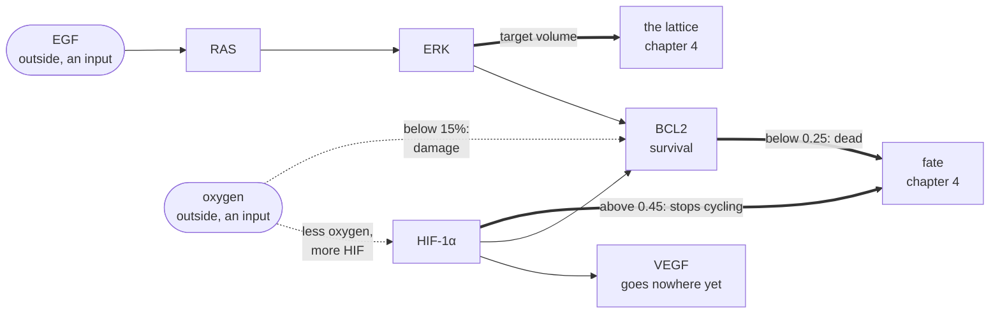

# 2. What happens inside a cell

How does a cell know there is food outside, and decide to grow?

## In the body

A cell does not decide to divide on its own. It waits for permission, and the permission is a molecule. A **growth factor** is a small protein released by other cells that means, roughly, "there is room and food here, grow". It binds a **receptor**, a protein sitting across the cell membrane with one end outside and one inside, and that binding starts a chain of relays inside the cell. Each relay is a protein that, once activated, activates the next. The chain is called a **signalling pathway**, and it ends in the nucleus, where the last relay switches genes on or off.

The pathway in cellweave is the one most often broken in cancer:

- **EGF**, epidermal growth factor, first found because it makes skin cells multiply. The input.
- **RAS**, a protein that works as an on/off switch, named after the rat sarcoma virus it was discovered in. When a receptor is bound, RAS flips on.
- **RAF** and **MEK**, two intermediate relays, kinases both. A **kinase** is an enzyme that activates another protein by attaching a phosphate group to it.
- **ERK**, extracellular signal-regulated kinase, the last relay. Active ERK enters the nucleus and switches on the genes for growth and division.

A mutation in RAS, found in roughly one cancer in three, leaves the switch stuck on. ERK stays active with no growth factor present, and the cell divides without being told. Several drugs target individual links of this chain.

Two more proteins matter here, both about surviving hardship rather than growing:

- **HIF-1α**, hypoxia-inducible factor 1 alpha. Under normal oxygen it is made and destroyed continuously, and there is little of it. As oxygen falls, its destruction slows and it accumulates. It is the cell's hypoxia response: it switches on genes for making new vessels, for surviving on less, and for stopping the cell cycle.
- **BCL2**, B-cell lymphoma 2, a survival protein. It holds off the cell's self-destruct machinery. When it collapses, the cell dies.
- **VEGF**, vascular endothelial growth factor, is what HIF-1α makes the cell secrete to call for new blood vessels. It is computed here and, for now, goes nowhere.

## In cellweave

Each cell carries five numbers between 0 and 1, the activated fraction of each protein: RAS, ERK, HIF-1α, VEGF, BCL2. And five equations say how each one changes over time given the others and what the cell sits in.

The equations, from `ode.rs`, with each term named:

| protein | changes as | meaning |
|---|---|---|
| RAS | `0.5 egf (1 - ras) - 0.3 ras` | switched on by EGF, switches itself off at a steady rate |
| ERK | `0.8 ras (1 - erk) - 0.4 erk` | switched on by RAS, likewise |
| HIF-1α | `0.6 (1 - o2) (1 - hif1) - 0.5 hif1` | made faster the less oxygen there is, destroyed at a steady rate |
| VEGF | `0.7 hif1 - 0.3 vegf` | made in proportion to HIF-1α |
| BCL2 | `0.2 erk + 0.1 hif1 - 0.15 (bcl2 - 0.5) - 0.25 anoxia` | fed by ERK and HIF-1α, relaxes toward 0.5, and damaged below the anoxia threshold |

Every `(1 - x)` is saturation: a protein already fully active cannot be activated further. This is why ERK settles near 0.55 even when drowned in EGF.

The last term of BCL2 is the one that kills. `anoxia` is zero above 15% oxygen and rises to 1 at zero oxygen. Below the threshold, damage pulls survival down regardless of what ERK and HIF-1α feed in. That is deliberate: **necrosis is not a decision, it is a failure**. Below a critical oxygen level the cell cannot make enough energy, damage accumulates, and no survival programme rescues it. It is distinct from **apoptosis**, the orderly, programmed death a cell can choose. Only necrosis exists here so far.

### How the equations are solved

Five equations that say "the rate of change of x is this function of x and the inputs" are an **ODE** system, ordinary differential equations: they involve time only, no space. They are advanced with **RK4**, the fourth order Runge-Kutta scheme, the standard way to integrate an ODE numerically with good accuracy. Each step of one unit of network time, the scheme evaluates the rates four times and blends them.

The network settles in about fifteen units of its time. The binary gives it eight units per lattice step, so it answers in about two. Why eight is chapter 3.

## Choices, and why

**Concentrations, not molecules.** Each protein is one number, a fraction between 0 and 1, as if the cell were a well-stirred bag. A real cell has thousands of copies of each protein in specific places. Averaging is the standard first model and it keeps five equations rather than five million.

**A reduced chain.** RAF and MEK are skipped: RAS activates ERK directly. They relay without deciding, and two more equations would add constants without adding behaviour. If a drug that targets MEK ever matters, they come back.

**ERK sets the target volume**, with the coefficient 1.5: `target = base (1 + 1.5 erk)`. It was 0.5 at first, and since ERK saturates near 0.55, no cell could ever reach the division threshold. The coefficient is chosen so a well stimulated cell aims at about twice its reference size. A model constant that silently makes a behaviour impossible is the kind of thing to state in a comment, not tune quietly.

**The damage term is separate from HIF-1α.** HIF-1α is pro-survival, and in this network hypoxia raises BCL2. That is real biology, and it means that without a damage term no cell could ever die of hypoxia. The damage term acts on BCL2 directly and is not offset by anything, because energy failure is not something a transcription programme can argue with.

## Where in the code

`crates/engine/src/ode.rs`

- `RasErkNetwork` holds the five values and the lineage's reference volume.
- `derivatives` is the table above.
- `rk4` advances one step; `step` is the public entry.
- `mechanics` turns ERK into a target volume for the lattice.
- `survival` is BCL2; `hypoxia_response` is HIF-1α; the binary reads both to decide a fate.
- `ANOXIA_THRESHOLD` and `ANOXIA_DAMAGE` are the death mechanism, with the derivation of their values in the comments.

`crates/core/src/traits.rs` has `SignalingNetwork`, the contract any other network would have to meet. To simulate a different paper's network is to write another implementation, not to touch the engine.

## Still a placeholder

Every rate constant in the table is a plausible number, not a measured one. The literature has measured values for parts of this pathway, and calibrating against them is future work. What is fixed by the current numbers: ERK saturates near 0.55, the network settles in about fifteen units of its time, survival collapses between 5% and 6% of the bath's oxygen and is intact above 10%. Those are the facts the rest of the model was built on, and they are pinned by tests, so changing a constant that moves them will say so.
