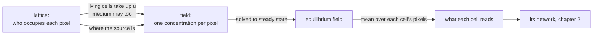

# 3. Oxygen

Where does oxygen come from, how far does it get, and why is it already at equilibrium whenever a cell looks?

## In the body

Oxygen arrives in the blood and leaves it through the walls of **capillaries**, the finest vessels, a few micrometres across. From there it does not flow; it **diffuses**, wandering from where there is more to where there is less, and every cell it passes takes some. So its concentration falls with distance from the vessel, and at some distance it is gone. That distance is about 100 to 200 micrometres, and it is why no cell in the body sits further than that from a capillary. A tumour that outgrows its vessels starves at exactly that depth.

In a dish, a ball of cells, a **spheroid**, sits in culture medium, a large volume of liquid that is stirred and renewed and holds far more oxygen than a few hundred cells can use. From the cells' point of view the liquid is a **bath**: its concentration never drops, whatever they take. The gradient forms inside the ball.

Three time scales matter, and they are far apart. Oxygen crosses a cell in a fraction of a second. A signalling network answers in minutes. A cell divides in about a day. So at the moment a cell decides anything, the oxygen around it is already at equilibrium with where the cells are. It has no memory of its own.

## In cellweave

Oxygen is a **field**: one number per pixel, a fraction of what the source holds, on the same grid as the cells. It obeys a **PDE**, a partial differential equation, one that involves space as well as time:

```
∂c/∂t = D ∇²c  -  λ c  +  S  -  u(x, y)
```

Read it left to right: the concentration at a point changes because oxygen diffuses in from neighbours (`D`, the diffusion coefficient, times the Laplacian, which measures how much a point differs from the average of its neighbours), decays (`λ`, zero here), is produced (`S`, zero here), and is taken up where tissue sits (`u`, the **uptake**, a sink per pixel set from the lattice).



### Two ways to be supplied

**A bath.** Every medium pixel a bath can reach from the edge of the box is held at 1.0. Reachability is the point: the bath spreads from the border through connected medium only, so a pocket walled in by cells, which is what a resorbed necrotic core leaves behind, is never reached and does not become a source of oxygen inside the tissue. The bath spreads through pixel faces, not corners, so a wall of cells touching only at their corners still seals.

**A vessel.** An obstacle disc in the middle of the box, held at 1.0. Around it there is no empty liquid but stroma, ordinary tissue that consumes too, so the medium takes up at the same rate as living cells. Oxygen falls with distance from the wall and is gone at some radius.

In both cases the walls of the box let nothing through. That is what takes the box out of the answer: when the edge of the box was the only supply, how much reached the tissue depended on how far the wall happened to be, and doubling the grid changed the biology. Now the same disc reads the same at its centre in a box of 30 and a box of 60, to solver precision, and the necrotic core of chapter 5 appears at the same step and size on a 200 and a 300 pixel grid.

### Solved to its steady state

Because oxygen equilibrates far faster than anything a cell does, the field is not stepped forward by some number of sub steps per lattice step. It is **relaxed**: iterated until it stops moving, every lattice step, so that what a cell reads is the equilibrium for the current layout.

The first way of doing that, stepping in time until the change per step was small, was wrong twice. A tolerance on the per step change is blind to a slow front: each step moves less than the tolerance while the total drifts for hundreds of steps. And once the tolerance was set correctly, well below the uptake, the slowest mode of a region of size L took about L² steps to settle, and a run did not finish. The field is now solved by **successive over-relaxation**, SOR: sweep the grid in a fixed order, set each pixel to the value that balances diffusion against uptake given its neighbours as they stand, and push it a little past that value to hurry the slow modes along. About L sweeps instead of L². Floored at zero, since tissue cannot take up what is not there. And once, before the first step, the field is settled very tightly, so that every later step is an increment on a true equilibrium.

### The three clocks, in the model

| clock | in the body | in cellweave |
|---|---|---|
| oxygen | a fraction of a second across a cell | instantaneous: relaxed to equilibrium every lattice step |
| signalling | minutes | about 2 lattice steps: 8 units of network time per step, the network settles in 15 |
| cell cycle | a day | about 20 lattice steps at full oxygen |

The order is the one biology has; the ratios are compressed. The middle row was the surprise: at one unit of network time per step, the network took fifteen steps to answer and a cell divided in twenty, so a cell's fate trailed its surroundings by most of a generation. A test pins the fifteen so that a change to the constants that moves it will say so.

## Choices, and why

**A bath held to the surface, not a box with a source at the edge.** Explained above; it is the difference between a simulation of a spheroid and a simulation of a box.

**Uptake as a sink in the equation, not an amount subtracted once.** Relaxation would diffuse a one off subtraction away; a sink stays.

**Stroma consumes at the tumour's rate.** A modelling choice, not a measurement. Without it the medium beyond a cord would fill from the vessel and hand oxygen back to cells that should be starving.

**The uptake rate is a configuration value**, and the two example files use different numbers. A bathed disc is fed from its whole perimeter; a vessel is a small circle whose flux thins as 1/r. A flux balance at the wall gives, for the same uptake, a cord a tenth as deep as a spheroid's viable rim. The geometry changes the formula, not only the numbers.

**Refuse rather than clamp.** Explicit time stepping is only stable while `D dt ≤ 1/4` on a unit grid, and past that limit it does not fail, it oscillates and grows while still producing numbers. `step` refuses such a time step. NaN is refused explicitly too, because it compares false against every bound and would pass every range check.

## Where in the code

`crates/engine/src/pde.rs`

- `ScalarField` holds the values, the sinks, and which pixels are held.
- `step` is one explicit time step, for what needs time; `check_step` is the stability guard.
- `relax` is the steady-state solve by SOR; `sor_sweep` is one pass.
- `hold_bath` is the flood fill from the border; `hold_pixels` holds a given set; `release_all` forgets both.
- `set_uptake` and `clear_uptake` are the sinks.

`crates/engine/src/coupling.rs` is where the lattice and the field meet: `apply_uptake`, `apply_background_uptake`, `hold_medium_bath`, `hold_obstacles_at`, and `mean_per_cell`, which is what each cell reads.

The tests in `pde.rs` include the two that matter most: the same disc in two boxes agrees to solver precision, and a bathed consuming disc settles on the closed-form profile `c(0) = c_s - q R² / (4 D)`, which nothing in the solver was tuned against.

## Still a placeholder

`D = 0.2` pixels squared per unit time, and the two uptake values, `0.0003` for the spheroid and `0.00003` for the cord. They were chosen so that each geometry shows its structure on a 200 pixel grid, and for no other reason. The spheroid's viable rim comes out about one cell thick where a real one keeps several. And no unit of length or time has been fixed, so `D` cannot yet be compared to the measured diffusion coefficient of oxygen in tissue.
