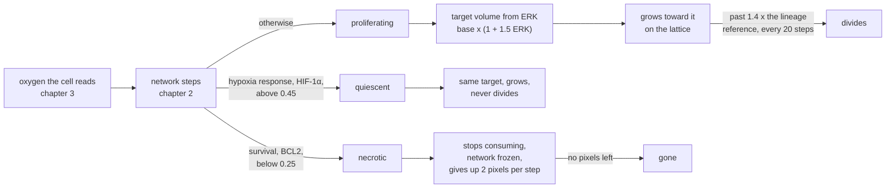
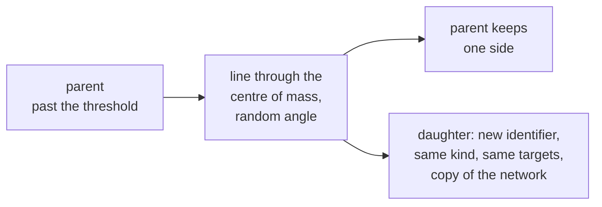

# 4. What a cell does with what it reads

Grow, wait, or die: how one number becomes a fate, and how a cell splits in two.

## In the body

A cell in a tissue is in one of a few states, and oxygen is one of the main things that moves it between them.

**Proliferating.** Enough oxygen, enough growth signal: the cell runs its cycle, grows, and divides. At the end of the cycle it splits into two daughters, each with a copy of its chromosomes and, roughly, half of everything else.

**Quiescent.** Alive, metabolising, holding its place, but not cycling. Hypoxia arrests the cell cycle well before it kills, through HIF-1α and the proteins it switches on. Quiescent cells are a large part of any tumour, and they are the ones chemotherapy, which targets dividing cells, tends to miss.

**Necrotic.** Dead by energy failure, as in chapter 2. The membrane gives way, the contents spill, and what is left is cleared over days by the body's scavenger cells. In a tumour, necrosis is what fills the space beyond the reach of oxygen.

A cell's size at division is a property of its type, not of the individual. Daughters are born small and grow back to the size their lineage divides at.

## In cellweave

Every lattice step, each living cell's network is advanced with the oxygen the cell sits in, and then two of its numbers decide a fate:

**Proliferating.** The network's ERK sets the target volume, the lattice pulls the cell toward it, and every twenty steps any tumour cell past 1.4 times its lineage's reference volume is cut in two.

**Quiescent** is not a kind on the lattice; it is a condition read each time: hypoxia response above 0.45, which the network reaches near a third of the source's oxygen. A quiescent cell still grows toward its target and still holds its place. It only does not divide. Without this middle state nothing bounds growth short of death.

**Necrotic** is a kind. It stops consuming, its network is frozen where it stopped, and its target volume is lowered by two pixels each step so that neighbours take its place. When it holds no pixel it is **gone**: its slot in the list of networks becomes empty and the lattice keeps only a tombstone so identifiers stay stable.

### Division

A cell is cut along a straight line through its centre of mass, at an angle drawn at random. Pixels on one side keep the parent's identity; the rest go to a new cell of the same kind that inherits the parent's targets and a copy of its network, protein state and all. A cut that would leave one side empty is rolled back and nothing changes.

The division threshold is measured against the **lineage's reference volume**, which a daughter inherits unchanged. A daughter born at 140 pixels does not divide at 1.4 times 140; it divides at 1.4 times the reference, like its parent did. That is how a cell type keeps a characteristic size across generations, and it is the biology of the last paragraph above.

## Choices, and why

**Thresholds are constants; where they land is not.** 0.25 on survival, 0.45 on the hypoxia response, 1.4 on volume. These are the places where a continuous signal becomes a discrete decision, and there is no way around a number there. What is not a number is where in space each fate lands: that comes out of the balance between diffusion and uptake, and it is the point of the model.

**Quiescence on HIF-1α, not on oxygen directly.** It would be simpler to say "below such oxygen, stop dividing". Saying it through the hypoxia response keeps the rule at the level of protein state, which is where the project wants every behaviour to come from, and it means a network with a different hypoxia response would quiesce differently without touching the binary.

**The grid is the truth about volume.** `divide` counts the parent's pixels from the grid and rewrites both records from that count, so any earlier drift in the bookkeeping is corrected rather than carried. A test checks that records still match the grid after dividing, stepping, dividing again and stepping again.

**Resorption at a fixed rate**, two pixels per step, rather than instantly. A dead cell that vanished at once would free its whole area in one step. Two pixels per step clears a cell in about seventy steps, a few generations, which is at least the right order.

**One slot per cell, asserted.** Identifier `i + 1` names the cell whose network is at index `i`. That pairing is what every fate and every target relies on, and it is checked after every round of division rather than trusted: were the two to drift, a network would quietly drive the wrong cell and no test would notice.

## Where in the code

`src/main.rs`, the loop, steps 1 to 6 in the comments: relax the field, read, step the networks, decide fates and set targets, Monte Carlo, divide, snapshot.

- `divide_ready_cells` is the division rule and the assertion.
- `DIVISION_RATIO`, `DIVISION_CHECK_EVERY`, `DEATH_THRESHOLD`, `QUIESCENCE_THRESHOLD`, `RESORPTION_RATE` are the constants, each with the reason for its value.
- `living` and `write_snapshot` are what gets counted and recorded.

`crates/engine/src/cpm.rs`: `divide`, `set_volume_target`, `set_kind`, `cell_kind`.

`crates/engine/src/ode.rs`: `mechanics`, `survival`, `hypoxia_response`, `base_target_volume`.

## Still a placeholder

All three thresholds, the growth coefficient 1.5, the division ratio 1.4, the check every twenty steps, and the resorption rate. Growth is fast: a cell doubles in about twenty steps at full oxygen, and with the clocks as they are that is a compressed but consistent day. Only one kind of death exists; apoptosis, the programmed kind, is what a drug would trigger, and it is not here. Nothing varies from parent to daughter yet: a daughter is an exact copy, so there is nothing for selection to act on.
