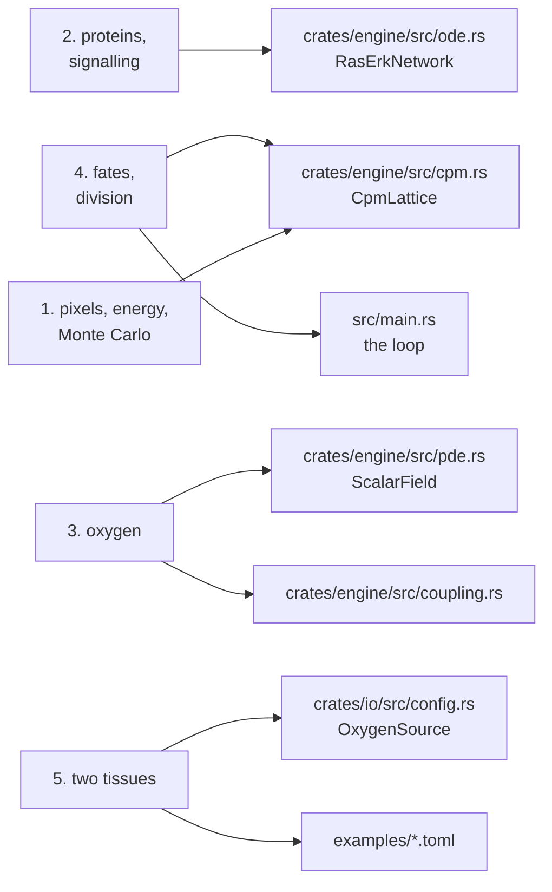

# The course

What cellweave simulates, explained from the biology up, one notion at a time, in the order the software needed them. Every chapter says what a thing is in the body, what cellweave makes of it, which choices were made and why, where in the code it lives, and what is still a placeholder. The point is to be able to come back in six months and understand the program, not only run it.

Each chapter follows the same shape:

- **In the body**: the biology, defined before it is used.
- **In cellweave**: the model, with a diagram.
- **Choices, and why**: what was decided, and what it costs.
- **Where in the code**: file and symbol, so the claim can be checked.
- **Still a placeholder**: what is a number picked to make something show, not a measurement.

Chapters build on each other and are meant to be read in order the first time.

| | Chapter | The question it answers |
|---|---|---|
| 1 | [A cell is a set of pixels](01-a-cell-is-a-set-of-pixels.md) | How can a cell have a shape, push on its neighbours, and move, without anyone telling it where to go? |
| 2 | [What happens inside a cell](02-what-happens-inside-a-cell.md) | How does a cell know there is food outside, and decide to grow? |
| 3 | [Oxygen](03-oxygen.md) | Where does oxygen come from, how far does it get, and why is it already at equilibrium whenever a cell looks? |
| 4 | [What a cell does with what it reads](04-what-a-cell-does-with-what-it-reads.md) | Grow, wait, or die: how one number becomes a fate, and how a cell splits in two. |
| 5 | [Two tissues](05-two-tissues.md) | A spheroid that starves from the inside, and a cord that lives around a vessel and never stops turning over. |
| 6 | [What the model does not say](06-what-the-model-does-not-say.md) | The placeholders, the missing units, and why emergence is the whole point. |
| | [Glossary](glossary.md) | Every word, in one place. |

## How the chapters map onto the code

The README at the root of the repository says what works and what does not today. This course says why.
